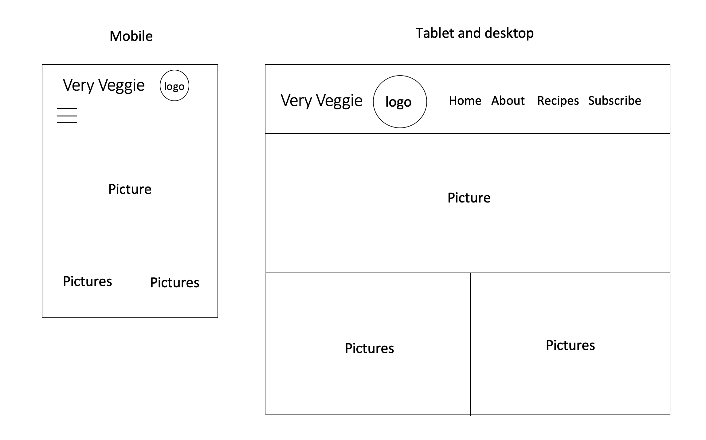
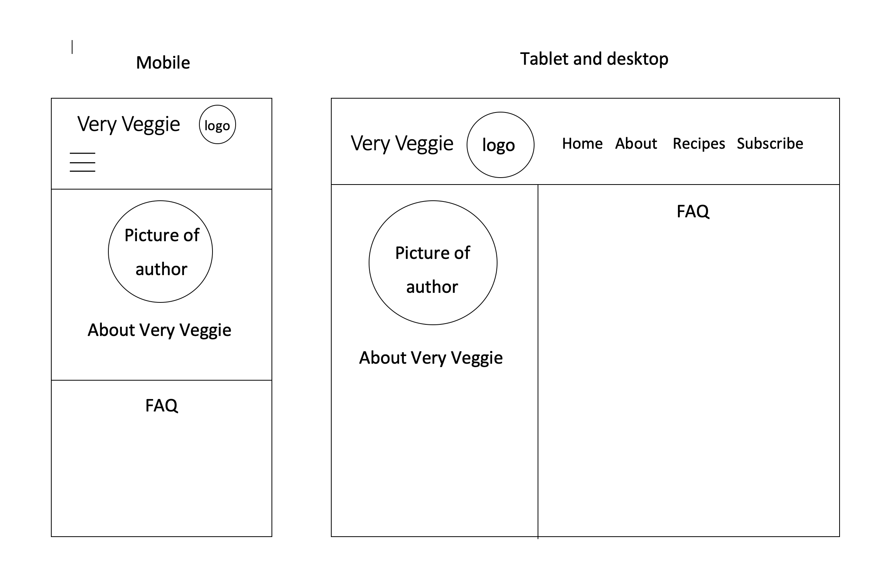
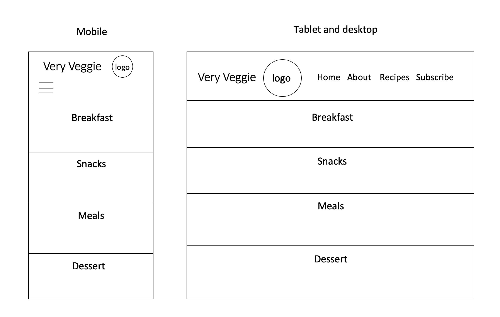
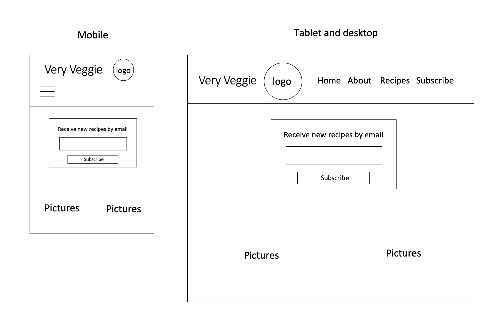
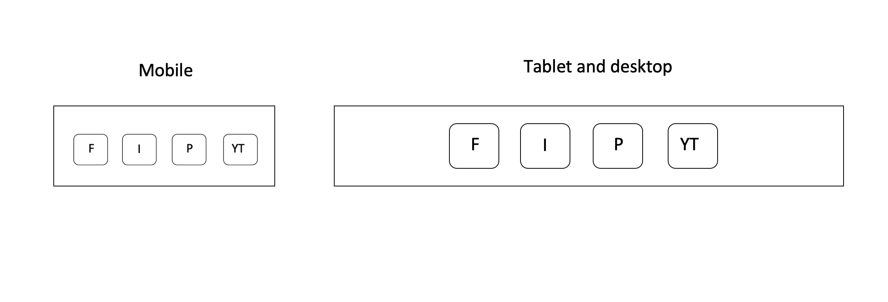

# Very Veggie - Milestone Project 1 

This project was created as the first of four milestone projects for Code Institute. 
The challenge was to create a static front-end cooking website. We needed to utilize the skills that were learnt in the first few modules, 
specifically HTML and CSS. This project was built as a recipe index for users wanting access to vegetarian and vegan recipes. The purpose
of the project was to provide recipes for users practicing a vegetarian and vegan diet as well as users wanting to explore vegetarian and 
vegan recipes. It was also built to inform users about a vegetarian and vegan diet. 
 
## UX
 
This website is for users practicing or exploring a vegetarian/vegan diet and users wanting access to vegetarian/vegan recipes. This website 
attempts to achieve that goal by providing navigation links in the navbar to finding out more about the website, proviiding access to a recipe 
index, and being able to subscribe to the website and recieve recipes via email. The footer contains links to various social media accounts, that
can be used to further explore. 

##### User Stories

- As a vegetarian/vegan, I would like to visit the website to gain access to the recipes offered. 

- As a vegetarian/vegan, I woould like to subscribe to the website to receive recipes via email. 

- As a potential vegetarian/vegan, I would like to find out more about the website and what a vegetarian/vegan diet entails. 

- As a potential vegetarian/vegan, I would like to visit the website to find out more about author. 

- As a potential vegetarian/vegan, I would like to visit the website to see what vegetarian/vegan recipes require. 

#### Wireframes

- Home 
- About 
- Recipes 
- Subscribe 
-  Footer 

## Features
 
### Existing Features

- This website consists of four pages; Home, About, Recipes, and Subscribe.  
- The navbar appears at the the top of every page, which contains links to various sections of the website. It is collapsed on mobile screens
  with a small hamburger icon below the website name in the top left-hand corner. 
- The first page is the Home page, which contains a panoramic image and two smaller images below the banner image.
- The second page is the About page, which contains two sections, the first is information about the author and website and the second is 
  frequnetly asked questions. 
- The third page is the Recipes page, which contains a number of different recipes divided into sections; Breakfast, Snacks, Meals, and Dessert.
  Each recipe has an image with the recipe name below.  
- The fourth and final page is the Subscribe page, which contains a panoramic image and two smaller images below the banner image. On the panoramic image
  is a form that invites users to sign up with their email to recieve free weekly recipes. 
- A footer appears at the bottom of every page,which has links to a number of social media accounts.

### Features Left to Implement

- A detailed information page about being vegetarian/vegan and the different benefits it has. Along with nutritional information about different 
  fruits and vegetables.
- Recipe pages for each of the recipes. 
- A video tutorial for each of the recipes, embedded in each recipe page. 

## Technologies Used

- html5
 - The project uses **html5** to create the layout for the website. 

- CSS3
 - The project uses **CSS3** to style all content. 

- [bootstrap](https://getbootstrap.com/)
 - The project uses **bootstrap** primarily for the grid system and navbar sample. 

- [JQuery](https://jquery.com)
    - The project uses **JQuery** for interactivity.

## Testing

I validated my HTML and CSS code using the W3C validator. I had no errors or warnings to show. I examined my website in both
Chrome and Safari to check for cross brower compatibility. I used the responsive design mode in both browsers examining my site at 
various screen sizes. In both Chrome and Safari I viewed the site on the following devices:

- Galaxy S5
- Pixel 2
- Pixel 2 XL
- iPhone 5/SE
- iPhone 6/7/8
- iPhone 6/7/8 plus
- iPhone X
- iPad
- iPad Pro
- Laptop screen

I also filled out the contact form to ensure that it worked as it was supposed to. 
As well as this, I clicked on each link in my Navbar to make sure that I was taken to the relevant section. 

## Deployment

I deployed my website via GitHub pages. I also deployed the code locally in both Chrome and Safari.

## Credits

### Content
- The text from the About page was copied from [PickupLimes](https://www.pickuplimes.com/)
- The recipes from the Recipe page were copied from [PickupLimes](https://www.pickuplimes.com/)

### Media
- The panoramic photo used in index.html was obtained from (https://images.immediate.co.uk/)
- The panoramic image used in subscribe.html was obtained from [AbsoluteProduce](https://www.absoluteproduce.com/what-we-do)
- The photos used in index.html and subsribe.html were obtained from [TescoRealFood](https://realfood.tesco.com/gallery/10-healthy-vegetarian-recipes.html)
- The photo of the author was obtained from my personal photos
- The panoramic photo used in about.html was obtained from [OliveMagazine](https://www.olivemagazine.com/recipes/vegan/healthy-vegan-recipes-under-350-calories/)
- The photos used in recipes.html were obtained from [PickupLimes](https://www.pickuplimes.com/)

### Acknowledgements
- The layout of my navbar was taken from [bootstrap](https://getbootstrap.com/)
- The JavaScript code for my hamburger icon was taken from [bootstrap](https://getbootstrap.com/)
- The code for my form was taken from [W3Schools](https://www.w3schools.com/howto/howto_css_signup_form.asp)
- The code for my responsive images was taken from [W3Schools](https://www.w3schools.com/howto/howto_css_image_responsive.asp)
- The code for my hover transition was taken from Code Intitute's [MiniProjectwithBootstrap4](https://github.com/Code-Institute-Solutions/resume-miniproject-bootstrap4/tree/master/)

